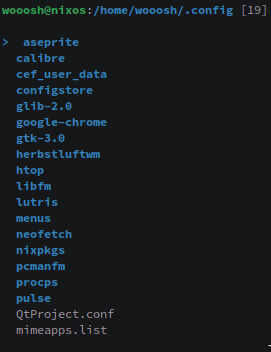

# filet

A fucking fucking fast file fucker (a so called fufufafifu)



## Usage

`filet`. Done.

Optionally give it a directory to open like this `filet <dir>`.

Also you can use the following snippet to automatically switch to the directory you quit in.

```bash
f() {
    filet "$@"
    cd "$(< /tmp/filet_dir)"
}
```

You can set `FILET_OPENER` to a program to open files with. This defaults to `xdg-open`.

## Installation

You can install filet from the following repositories:

| Repo    | Name      |
|---------|-----------|
| AUR     | filet-git |
| nixpkgs | filet     |

### Manually

Building filet yourself is pretty straight forward.

1. Install 0 dependencies
2. `make`

To install it you can use `make install`.

## Why?

```
             -     =    .--._
       - - ~_=  =~_- = - `.  `-.
     ==~_ = =_  ~ -   =  .-'    `.
   --=~_ - ~  == - =   .'      _..:._
  ---=~ _~  = =-  =   `.  .--.'      `.
 --=_-=- ~= _ - =  -  _.'  `.      .--.:
   -=_~ -- = =  ~-  .'      :     :    :
    -=-_ ~=  = - _-`--.     :  .--:    D
      -=~ _=  =  -~_=  `;  .'.:   ,`---'@
    --=_= = ~-   -=   .'  .'  `._ `-.__.'
   --== ~_ - =  =-  .'  .'     _.`---'
  --=~_= = - = ~  .'--''   .   `-..__.--.
 jgs--==~ _= - ~-=  =-~_-   `-..___(  ===;
 --==~_==- =__ ~-=  - -    .'       `---'
```

## Keybinds

| Key | Function                          |
|-----|-----------------------------------|
| j/k | Move up/down                      |
| h   | Leave directory                   |
| l   | Enter directory/open file         |
| ~   | Move to home                      |
| /   | Move to root                      |
| .   | Toggle dotfile visibility         |
| g   | Select first item                 |
| G   | Select last item                  |
| r   | Reload directory                  |
| e   | Edit with $EDITOR                 |
| s   | Spawn $SHELL in current directory |
| m   | Mark item as selected             |
| x   | Delete selected items             |
| q   | Quit                              |
